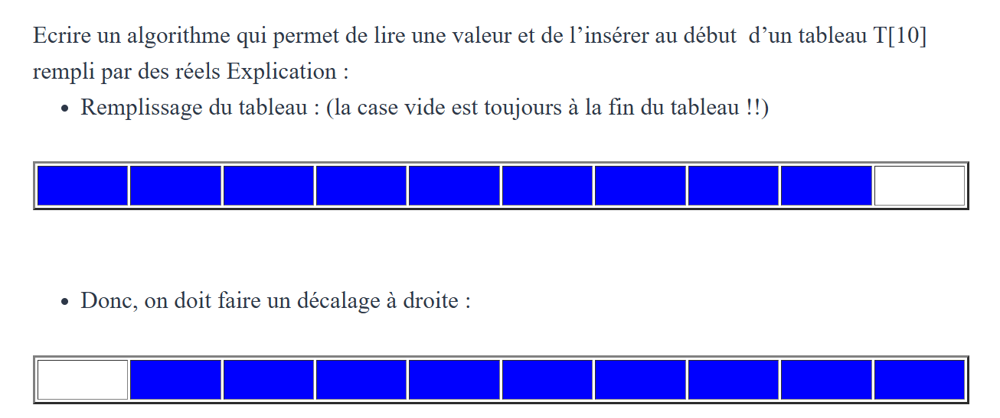
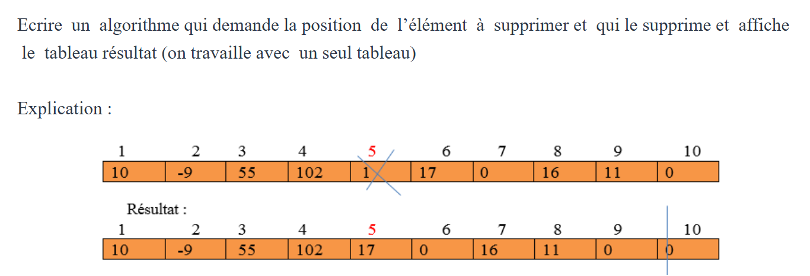
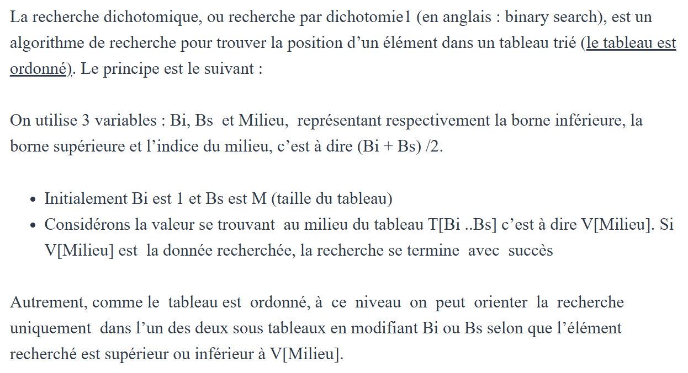
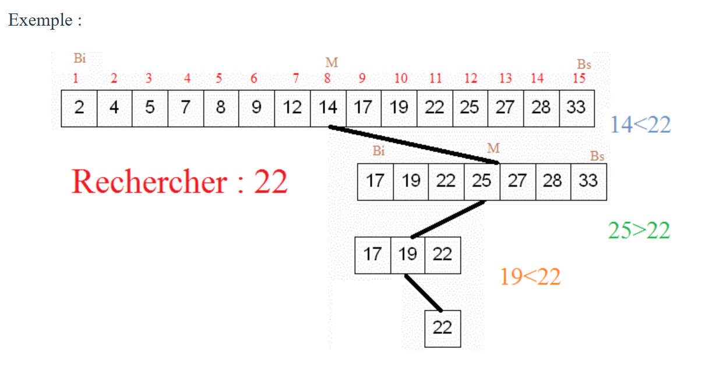
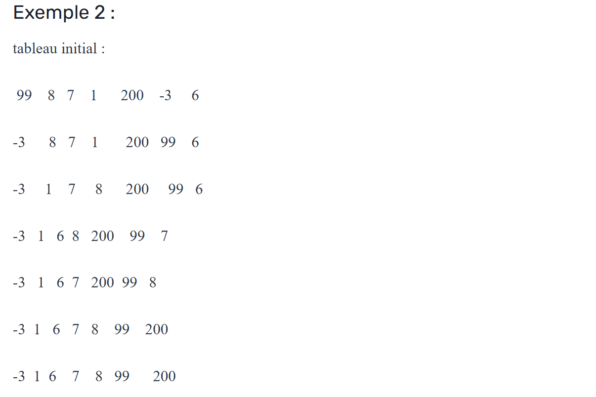

### <h2 style="color: rgb(0, 115, 255);"> Instruction de base : </h2>

#### <h3 style="color: rgb(255, 20, 20);">Déclaration des variables:</h3>

Algorithme : Déclaration des variables
variable nomv : type
variables nomv1 , nomv2 : type
variables nomv1 , nomv2 : type
nomv3 : type

#### <h3 style="color: rgb(255, 20, 20);">Types des Variables:</h3>

| Types               | exp        |
| ------------------- | ---------- |
| Entier              | 93         |
| Réel                | 9.4        |
| caractere           | “H”        |
| Chaine de caractere | “Bonjour”  |
| Booléén             | true/false |

#### <h3 style="color: rgb(255, 20, 20);">Instructoin de base:</h3>

##### <h4 style="color: green;">Instruction d’entrée/sortie:</h4>

Ecrire (”Entrez l’age:”)
Lire (n)

##### <h4 style="color: green;">Opération</h4>

Opération arithmétique (Nombres):

| +   | 2+5=7  |
| --- | ------ |
| -   | 8-4=4  |
| \*  | 3\*3=9 |
| /   | 8/2=4  |
| %   | 7%3=1  |

Opération cocaténation (chaine):

Ecrire(”3”+”7”) ⇒ 37

##### <h4 style="color: green;">Affectation: </h4>

exemple:
x ← 10
x ← x\*2
x ← x-2
Ecrire (x) ⇒ 18

### <h2 style="color: rgb(0, 115, 255);">Les strectures : </h2>

#### <h3 style="color: rgb(255, 20, 20);">Strectures alternatves :</h3>

##### <h4 style="color: green;">Si & Sinon & Fin Si ( if & elif & else )</h4>

```abap
algoritme: exemple
	variable note:réel
Début
	Ecrire("Enrez la note:")
	lire (note)
	Si (note>=10) Alors
		Ecrire("Admis")
	sinon
		Ecrire("Redoublant")
	FinSi
Fin
```

```python
print("Enrez la note:")
note=(int(input()))
if note>=10 :
	print("Admis")
else :
	print("Redoublant")
```

```python
print("Enrez la note:")
note=(int(input()))
if 0<note<20 :
    if note>=10 :
        print("Admis")
    else :
        print("Redoublant")
else:
    print("ERROR")
```

##### <h4 style="color: green;">(Imbriquées)</h4>

```abap
Algorithme: pos/neg
	variable n:entier
Début
	Ecrire("Enrez le nbr:")
	lire (n)
	Si (n>0) Alors
			Ecrire("positive")
	sinon
		Si (n=0) Alors
			Ecrire("nul")
		sinon
			Ecrire("négative")
		FinSi
	FinSi
Fin
```

```python
print("Enrez le nbr:")
n=(int(input()))
if n>0 :
	print("positive")
else :
	if n==0 :
		print("nul")
	else :
		print("négative")
```

```abap
Algorithme: ista
		Variables  nom,lng :Chaine de caractere
Début
		Ecrire("Entrez ton nom :")
		lire (nom)
		Si (nom="Zakaria") ou (nom="Haytam") ou (nom="Anas")
				Ecrire("Inscrit")
		Sinon
				Ecrire("Lire le langage que vous apprendre:")
				lire(lng)
				Si (lng="Java") ou (lng="C")
						Ecrire("Inscription effectuée")
					Sinon
						Ecrire("Nous ne proposons pas ce langage")
				FinSi
		FinSI
Fin
```

```python
print("Entrez ton nom :")
nom=(str(input()))
if (nom=="Zakaria") or (nom=="Haytam") or (nom=="Anas") :
	print("Inscrit")
else :
	print("Lire le langage que vous apprendre:")
	lng=(str(input()))
	if (lng=="Java") or (lng=="C") :
		print("Inscription effectuée")
	else:
		print("Nous ne proposons pas ce langage")
```

#### <h3 style="color: rgb(255, 20, 20);">Strectures répétitives :</h3>

##### <h4 style="color: green;">1. La boucle pour (for) :</h4>

```abap
Algorithme: 10 nombres
	Variables  i , n , min :Entière
Début
	i=0
	Ecrire("Ecrire un nombre:")
	lire(n)
	min=n
	Pour i de 1 a 9 faire
		Ecrire("Ecrire un nombre:")
		lire(n)
		Si (min>n) Alors
			min <- n
		FinSi
	FinPour
	Ecrire("Min="min)
Fin

```

```python
i=0
n=int(input("Ecrire un nombre:"))
min=n
for i in range(2,10):
	n=int(input("Ecrire un nombre:"))
	if min > n:
		min=n
print(min)
```

##### <h4 style="color: green;">2. La boucle tant que (while) :</h4>

```abap
Algorithme
	Variables n :Entière
Début
	Ecrire("Entrez les chiffres et si vous voulez arrêter, appuyez sur 0")
	lire(n)
	Tant que (n<>0)
		Si (10<=n<=99)
			Ecrire(n)
		Fin Si
		Ecrire("Entrez les chiffres et si vous voulez arrêter, appuyez sur 0")
		lire(n)
	Fin Tant que
Fin
```

```python
n=int(input("Entrez les chiffres et si vous voulez arrêter, appuyez sur 0: "))
while n!=0:
	if n>9 and n<100 :
		print(n)
	n=int(input("Entrez les chiffres et si vous voulez arrêter, appuyez sur 0: "))
```

```abap
Algorithme
 Variables i , n :Entières
Début
	n<-2
	i<-0
	Tant que (n<99)
		n=n+7
		i=i+1
		Ecrire( "U" , i , "=" , n )
	Fin Tant que
Fin
```

```python
n=2
i=0
while i<99 :
    n=n+7
    i+=1
    print("U" ,i , "=",n)
```

```abap
Algorithme
	Variables i , n , s , m :Entiers
Début
	Ecrire( "Entrez un nombre: ")
	lire(n)
	s=0
	i=0
	Tant que n>=0
		s=s+n
		i=i+1
		Ecrire( "Entrez un nombre: " )
		lire(n)
	Fin Tant que
	m=s/i
	Ecrire( "La moyenne: " , m )
Fin
```

```python
s=0
i=0
n=int(input("Entrez un nombre: "))
while n>=0 :
	s+=n
	i+=1
	n=int(input("Entrez un nombre: "))
m=s/i
print("La moyenne: " , m)
```

```abap
Algorithme
	Variables n :Entiers
Début
	Ecrire("Entrez un nombre :")
	lire(n)
Tant que (n!=0) et (n%2!=1) alors
		n=n-2
		Ecrire (n)
	Fin Tant que
Fin
```

```python
n=int(input("Entrez un nombre: "))
while n!=0 and n%2!=1 :
	n-=2
	print(n)

```

```abap
Algorithme
	Variables
Début
	Ecrire("Entrez un nombre: ")
	Lire(n)
	f=n
	Tant que n!=0 alors
		f=f*(n-1)
		n=n-1
	Fin Tant que
	Ecrire( "Factoriel=" , f )
Fin
```

```python
n=(int(input("Entrez un nombre: ")))
f=n
while n!=1 :
	f=f*(n-1)
	n=n-1
print( "Factoriel=" , f )
```

##### <h4 style="color: green;">3. La boucle répéter….jusqu’à (while …. if … : break ) :</h4>

```abap
Algorithme
	Variables n :Entiers
Début
	Ecrire("Entrez un nombre :")
	lire(n)
	Si n%2!=1 alors
		Répeter
			n<-n-2
			Ecrire(n)
		Jusqu'à n=0
	Fin Si
```

```python
n=int(input("Entrez un nombre: "))
while n%2==0 :
	n-=2
	print(n)
	if n==0 : break
```

```abap
Algorithme
	Variables
Début
	Ecrire("Entrez un nombre: ")
	Lire(n)
	f=n
	Répeter
		f=f*(n-1)
		n=n-1
	Jusqu'à n==1
	Ecrire( "Factoriel=" , f )
Fin
```

```python
n=(int(input("Entrez un nombre: ")))
f=n
while n!=0 :
	f=f*(n-1)
	n=n-1
	if n==1: break
print( "Factoriel=" , f )
```

### <h2 style="color: rgb(0, 115, 255);">Tableaux</h2>

#### <h3 style="color: rgb(255, 20, 20);">Une demontion</h3>

##### <h4 style="color: green;">Déclaration d’un tableau:</h4>


##### <h4 style="color: green;">Exemples</h4>

```abap
Algorithme
	Tableau T(20) :Entière
	Variables s , i :Entières
Début
	s=0
	pour i de 1à20 alors
		Ecrire( "Entrez la note d'éléve" , i ":")
		lire T(i)
		s=s+T(i)
	Fin Pour
	Ecrire( "la somme: " , s )
Fin
```

```python
T = [0] * 20
s = 0
i = 0
for i in range(0, 20):
    print(f"Entrez la note d'élève {i}:")
    T[i] = int(input())
    s += T[i]
print("La somme:", s)
```

#### <h3 style="color: rgb(255, 20, 20);">Les opération de base sur un tableau</h3>

##### <h4 style="color: green;">Insertion</h4>

###### 1- Insertion au début d’un tableau:



```abap
Algo_Insertion_Debut
	Tableau T(10):reel
	variables  i:entier
							x:réel
Début
		pour i allant de 1 à 9 faire
				ecrire "Donner un réel"
				lire T(i)
		fin pour
		ecrire "Donner la valeur à insérer"
		lire x
		pour  i allant de 9 a 1 faire [-1]
			T(i+1) <-- T(i)
		Fin pour
		T(1)<- x
		pour i allant de 1 à 10 faire
					ecrire T(i)
		fin pour
Fin
```

###### 2- Insertion au milieu d’un tableau:


```abap
Algo_Insertion_Milieu
	tableau  T(10): entier
	variables  x,i,p: entier
Début
		pour i allant de 1 à 9 faire
				ecrire "donner un nombre"
				lire T(i)
		fin pour
		ecrire "donner la position"
		lire p
		pour i allant de 9 à p [-1] faire
				T(i+1)←T(i)
		fin pour
		T(p)←x
		pour i allant de 1 à 10 faire
				ecrire T(i)
		fin pour
Fin
```

###### 3- Insertion à la fin d’un tableau:


```abap
Algo_Insertion_Fin
		Tableau T(10):reel
		variables  i:entier
								x:réel
Début
		pour i allant de 1 à 9 faire
				ecrire "Donner un réel"
				lire T(i)
		fin pour
		ecrire "Donner la valeur à insérer"
		lire x
		T(10)<- x
		pour i allant de 1 à 10 faire
			ecrire T(i)
		fin pour
Fin
```

##### <h4 style="color: green;">Modification</h4>


```abap
Algo_Ex1_Modification
		tableaux T(20): entier
		variables  x,i,c: entier
Début
		c←0
		pour i allant de 1 à 20 faire
				ecrire "donner un nombre"
				lire T(i)
		fin pour
		pour i allant de 1 à 20 faire
				Si T(i)<0 Alors
						T(i)←0
						c←c+1
				fin Si
		fin pour
		pour i allant de 1 à 20 faire
				ecrire T(i)
		fin pour
		ecrire ( "le nombre des nombres modifié est :",c )
Fin
```


```abap
Algorithme
		Tableau T(10) :Entiers
		Variables i :Entiers
Début
		Pour i allant de 1 à 10 faire
				Ecrire("Entrez un nombre")
				Lire(T(i))
		Fin Pour
		Pour i allant de 1 à 10 faire
			Si i%2=0 Alors
						T(i) <- 1
			Sinon
					T(i) <- T(i)*T(i)
			Fin Si
		Fin Pour
		Pour i allant de 1 à 10 faire
			Ecrire (T(i))
		Fin Pour
Fin
```


```abap
Algorithme
		Tableau T(10) :Entiers
		Variables i
Début
		Pour i allant de 1 à 10 faire
				Ecrire( "Entrez un nombre : ")
				Lire(T(i))
		Fin Pour
		Pour i allant de 3 à 10 faire
				T(i) <- T(i-1) + T(i-2)
		Fin Pour
		Pour i allant de 1 à 10 faire
				Ecrire(T(i))
		Fin Pour
Fin
```

##### <h4 style="color: green;">Suppression</h4>

###### 1- Opération de suppression: par position



```abap
Algoriyhme
		Tableau        T(20):reel
		variable        i,S:entier
Début
	pour i allant de 1 à 10 faire
			ecrire "donnez un nombre : "
			lire T(i)
	finpour
	ecrire "donnez la position de l’élément à supprimer : "
	lire S
	pour i allant de  S  à 9 faire
			T(i) <--T(i+1)
	finpour
	pour i allant de 1 à 9 faire
			ecrire T(i)
	finpour
fin
```

###### 2- Opération de suppression de valeur: (existe une seule fois)


```abap
Algo_Suppression_valeur
		tableaux T(20): entier
		variables  v, i,p: entier
debut
	ecrire "donner la valeur"
	lire v
	pour i allant de 1 à 20 faire
			Si v ==T(i) alors
					p ← i
					i ← 21
			fin Si
	fin pour
	pour i allant de p à 19 faire
			T(i) ← T(i+1)
	fin pour
	pour i allant de 1 à 19 faire
			ecrire T(i)
	fin pour
fin
```

###### 3- La suppression d’une valeur (existe plusieurs fois)


```abap
ALGO Supprition:
variable compteur,valeur,k,i:entier
	tableau t(20 ou n),:réel
debut
		ecrire("donner la taile de tableau T)
		lire(n)
		pour i allant de 1 a (20 ou n) pas 1 faire
				ecrire("pemlire la valeur : ",i)
				lire(T(i))
		fin pour
		ecrire ("ecrire la valeur a supprimer")
		lire(valeur)

		pour i allant de 1 a (20 ou n) pas 1 faire
				compteur==0
        si i==(20 ou n) alors
						i<-- (21 ou n+1)
				sinon
						si T(i)== valeur alors
								pour k allant de i a (19 ou n-1) pas 1 faire
										T(i)<-- T(i+1)
		            fin pour
								compteur<-- compteur+1
						fin si
				fin si
		fin pour
pour i allant de 1 a (20-compteur ou n-coumptuer)  pas 1 faire
	ecrire(T(i))
fin pour
fin

```

##### <h4 style="color: green;">Recherche</h4>

###### 1- Opération de recherche : recherche séquentielle


```abap
Solution Algo_Ex01:
		tableaux T(100): entier
			variables  s, i: entier
								existe : booleen
debut
		existe <-0
		ecrire "donner un valeur"
		lire s
		pour i allant de 1 à 100 faire
				Si ( s==T(i)) alors
						écrire "existence"
						existe<-1
						i<-101
				fin Si
		fin pour
		si existe =0 alors
				ecrire "n’existe pas"
		fin si
Fin
```

###### 2- Opération de recherche : recherche dichotomique




```abap
Algorithme :
		TABLEAU tab[M]  : ENTIER
		Variables     D,  Bi,  Bs,  Milieu : ENTIER
									Trouv : BOOLEEN

DEBUT
		ecrire "donner un valeur"
		LIRE(D)
		Bi  <-- 1
		Bs  <-- M
		Trouv  <--  FAUX
		TANTQUE Bi  <=  Bs  et NON Trouv
				Milieu  <-- (Bi  +  Bs   ) /2
				Si  (tab[Milieu]  =  D  ) alors
						Trouv <-- VRAI
				SINON
						SI  (D   <  tab[Milieu])     alors
								Bs   <--  Milieu  - 1
						SINON
								Bi <--  Milieu  +  1
						FinSI
				FinSI
		FIN TANTQUE
		Si trouv=False alors
				Ecrire  "n’existe pas "
		Sinon
				Ecrire "existe "
FIN
```

###### 3-Recherche séquentielle dans un tableau ordonné (ordre croissant)


```abap
Solution : Algo_Ex
		tableaux T(100): entier
		variables   s, i: entier
								existe : booleen
debut
		existe <-0
		ecrire "donner un valeur"
		lire s
		pour i allant de 1 à 100 faire
				Si ( s == T(i) )alors
						ecrire"existence"
						existe<-1
						i<-101
				fin Si
				si ( s > T(i) ) alors
						i<-101
				finsi
		fin pour
		si existe =0 alors
				ecrire "n’existe pas"
		fin si
Fin
```

#### <h3 style="color: rgb(255, 20, 20);"> Les algorithmes de Tri d’un tableau: </h3>

##### <h4 style="color: green;"> Algorithme de tri : Tri par sélection</h4>



